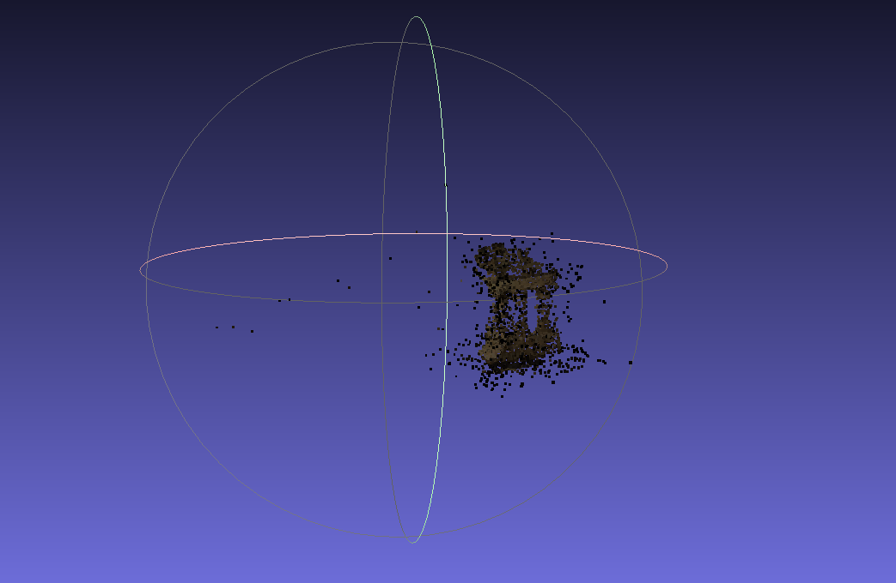
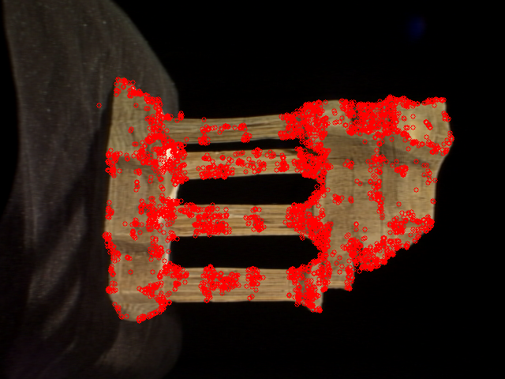
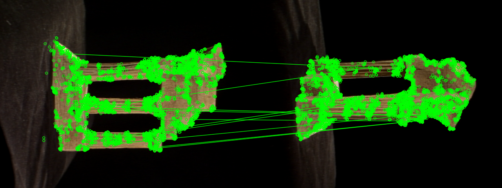

# Structure From Motion

CO543/CO5430 Computer Vision Project, Group 13.
Sparse 3D reconstruction from multiple images.

## Team

| Name | E-Number | Email |
|---|---|---|
| K.L.D.H. Liyanagama | E/23/202 | e23202@eng.pdn.ac.lk |
| W.G.R.P. Gamage | E/23/108 | e23108@eng.pdn.ac.lk |
| C.M.H.K. Chandrasekara | E/23/043 | e23043@eng.pdn.ac.lk |

## Problem statement

Given a set of overlapping images of a scene, recover the camera pose for
each image and a sparse 3D point cloud of the scene, using Structure from
Motion. This repo ships two independent pipelines that solve the same task
and can be compared side-by-side:

- **Classical feature-based SfM** (`run.py` + `sfm/`) — ORB
  (baseline) or SIFT (improved classical), brute-force matching, RANSAC
  geometric verification, incremental reconstruction, and sparse bundle
  adjustment.
- **Deep-learning-based SfM** (`deep_learning_pipeline/`) — SuperPoint
  features, LightGlue matching, and incremental reconstruction + bundle
  adjustment via `pycolmap` (through `hloc`).

Both pipelines output a sparse point cloud and camera poses, and both print
an identical M2/pose evaluation summary so the two methods can be compared
directly. See `docs/UserGuide.md` (index) and `datasets/templeRing/README.txt`
for dataset details.

## Pipeline overview

`run.py` drives `sfm/pipeline.py:run_pipeline()`:

1. **Feature detection** — ORB (baseline) or SIFT (improved classical)
   keypoints + descriptors per image (`features.py`).
2. **Matching** — brute-force + Lowe's ratio test (0.75), correct distance
   metric chosen automatically (Hamming for ORB, L2 for SIFT). Sequential
   pairs with wraparound by default (`MATCHING_STRATEGY=sequential`,
   `MATCH_WINDOW=6`; see `config.py`).
3. **Geometric verification** — RANSAC Essential matrix per pair
   (`geometry.py:geometric_verify`).
4. **Incremental reconstruction** — best initial pair (most inliers +
   triangulation angle), triangulate, then register each remaining image via
   PnP+RANSAC and triangulate new points (`reconstruction.py`).
5. **Bundle adjustment** — jointly refines all camera poses and 3D points
   with a sparse Jacobian (`bundle_adjustment.py`).
6. **Evaluation** — M2 structure summary plus Umeyama-aligned pose accuracy
   against TempleRing ground truth (`evaluate.py`).

Full user guides:

- `docs/ClassicalGuide.md` — classical run, outputs, evaluation, troubleshooting
- `docs/DeepLearningGuide.md` — SuperPoint + LightGlue + pycolmap run
- `docs/VisualizationGuide.md` — keypoints, matches, point-cloud viewers
- `docs/GaussianSplattingGuide.md` — downstream 3DGS rendering

## Results preview







## Setup

```bash
python -m venv venv
source venv/bin/activate        # Windows: venv\Scripts\activate
pip install -r requirements.txt
cd Hierarchical-Localization && pip install -e . && cd ..   # deep pipeline only (hloc)
```

## Dataset

This repo does not commit dataset images (see `.gitignore`).
Download TempleRing (Middlebury Multi-View Stereo dataset) yourself and place
the `.png` files in `datasets/templeRing/images/`. The calibration files
(`templeR_par.txt`, `templeR_ang.txt`, `README.txt`) are already included.

## Quick start

```bash
python run.py                          # ORB baseline (default), TempleRing
python run.py --feature_type sift      # SIFT variant
python run.py --out outputs/my_run     # custom output location
python -m deep_learning_pipeline.run_pipeline   # SuperPoint + LightGlue → outputs/lightglue/
```

Each classical run prints, in order: keypoints per image, matching progress,
the chosen initial pair, per-image PnP registration, bundle adjustment, the
M2 summary, and pose accuracy against ground truth.

## CLI reference

`run.py` flags (defaults come from `config.py`):

| Flag | Default | Description |
|---|---|---|
| `--feature_type` | `config.FEATURE_TYPE` (`orb`) | `sift` or `orb` |
| `--images` | `config.IMAGES_DIR` | Folder of input images |
| `--out` | `outputs/<feature_type>/` | Output folder (derives from `--feature_type` if not given) |
| `--gt_calibration` | `config.GT_CALIBRATION_PATH` | Ground-truth `*_par.txt` for intrinsics + pose scoring |
| `--no_gt_intrinsics` | off | Ignore GT intrinsics, use the width/height approximation |

Deep pipeline: `python -m deep_learning_pipeline.run_pipeline
[--dataset-dir] [--output-dir] [--skip-existing]` — see
`docs/DeepLearningGuide.md`.

## Outputs

Classical runs land in `outputs/<feature_type>/`:

- `points3D.ply`, `points3D_open3d.ply` (+ best-effort `points3D_open3d.png`) — sparse point cloud
- `cameras.json` — recovered camera poses + intrinsics
- `sparse/0/{cameras,images,points3D}.txt` — COLMAP text model when `EXPORT_COLMAP=True`
- `images/` — registered images copied for COLMAP/Gaussian Splatting

Deep runs land in `outputs/lightglue/`: `points3D.ply`, `poses.txt`,
`sparse/` binary COLMAP model, plus `features.h5` / `matches.h5` caches.

## Visualizing results

### 3D reconstruction (classical, interactive)

```bash
python view.py outputs/sift
python view.py outputs/sift --point_size 5.0
```

Opens Open3D with the cloud + orange camera frustums. Or open the `.ply` in
MeshLab (Point Splatting — it is a sparse, unmeshed cloud):

```bash
meshlab outputs/sift/points3D.ply
```

Deep model:

```bash
python -m deep_learning_pipeline.visualize --sfm-dir outputs/lightglue/sparse
```

See `docs/VisualizationGuide.md` for details and example images.

### Keypoints & feature matching

Visualize detected keypoints and pairwise matches without running the full
pipeline. Only `--feature_type` is required:

```bash
python viz_matches.py --feature_type sift
```

Writes to `outputs/<feature_type>_viz/`:

- `keypoints/keypoints_<i>.png` — keypoints per image (fixed r=3)
- `matches/<i>_<j>.png` — raw matches red + RANSAC inliers green
- `matches/inliers_<i>_<j>.png` — inliers only

Useful flags: `--pairs "0,1 1,2"`, `--interactive`, `--matching_strategy`,
`--match_window`, `--max_features`, `--gt_calibration`, `--out`.

## Project structure

```
Root/
├── run.py              # classical entry point (wires pipeline + evaluation)
├── sfm_baseline.py     # backward-compatible facade (re-exports sfm)
├── sfm/                # modular classical SfM implementation
│   ├── __init__.py      # public API re-export
│   ├── pipeline.py      # end-to-end orchestration (run_pipeline)
│   ├── cli.py           # direct module CLI (python -m sfm.cli)
│   ├── image_io.py      # image discovery and camera intrinsics
│   ├── features.py      # detection and matching
│   ├── geometry.py      # epipolar geometry and triangulation
│   ├── reconstruction.py # initialization and incremental registration
│   ├── bundle_adjustment.py # sparse joint pose/point refinement
│   ├── exporters.py     # PLY, camera JSON, and COLMAP text output
│   ├── visualization.py # Open3D export and snapshot rendering
│   ├── reporting.py     # RUN_STATS + M2 metrics summary
│   └── models.py        # Camera / Frame dataclasses
├── evaluate.py          # GT pose loading + M2/pose scoring (classical side)
├── viz_matches.py       # keypoint + feature-match visualization tool
├── view.py              # interactive 3D viewer (point cloud + camera frustums)
├── config.py            # classical parameters
├── requirements.txt    # shared deps for classical + deep pipeline
├── data/index.json      # team data (single source of truth)
├── datasets/templeRing/ # calibration + image folder (images gitignored)
├── outputs/             # per-run results (gitignored)
├── deep_learning_pipeline/ # SuperPoint + LightGlue + pycolmap pipeline
│   ├── run_pipeline.py  # extract → match → incremental mapping → export
│   ├── config.py        # dataset/feature/matcher config
│   ├── export_results.py # pycolmap → PLY + poses.txt
│   ├── visualize.py     # Open3D viewer for the sparse model
│   ├── evaluate.py      # M2 + pose evaluation (same output contract)
│   └── requirements.txt # extra deps only needed here
├── Hierarchical-Localization/ # hloc (SuperPoint+LightGlue → COLMAP glue)
│   └── install as editable: `cd Hierarchical-Localization && pip install -e .`
├── gaussian_splatting/  # 3D Gaussian Splatting on COLMAP outputs
│   ├── README.md        # pointer to docs/GaussianSplattingGuide.md
│   ├── prepare_dataset.py # SfM output → gsplat COLMAP layout
│   ├── export_ply.py    # gsplat checkpoint → 3DGS PLY
│   ├── train_server.sh  # idempotent GPU-server training script
│   ├── gaussian_splatting.ipynb # Colab walkthrough
│   └── data/            # prepared temple/ dataset (gitignored)
├── docs/                # user guides + mock/real images
│   ├── UserGuide.md     # index + comparison
│   ├── ClassicalGuide.md
│   ├── DeepLearningGuide.md
│   ├── VisualizationGuide.md
│   ├── GaussianSplattingGuide.md
│   └── assets/          # result figures (point clouds, keypoints, matches, renders)
└── tests/test_modular_sfm.py # regression tests for the classical package
```

## Further reading

- `docs/UserGuide.md` — guide index + side-by-side comparison
- `docs/ClassicalGuide.md`, `docs/DeepLearningGuide.md`,
  `docs/VisualizationGuide.md`, `docs/GaussianSplattingGuide.md`
- `deep_learning_pipeline/README.md` — deep pipeline pointer
- `gaussian_splatting/README.md` — 3DGS pointer
- `datasets/templeRing/README.txt` — dataset details
