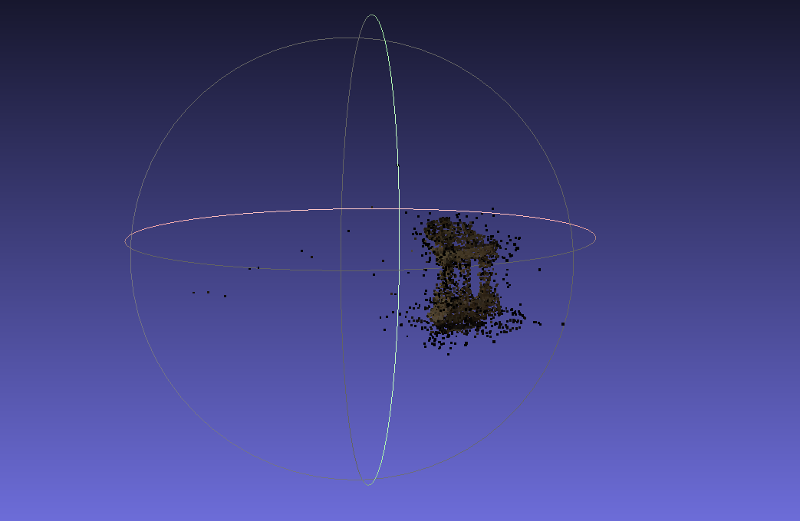

# Classical SfM User Guide (ORB / SIFT)

Hand-written incremental Structure-from-Motion in `sfm/`,
driven by `run.py`. No learned features, no COLMAP binary: OpenCV detection +
matching, Essential-matrix verification, incremental PnP registration,
triangulation, and sparse bundle adjustment.

## 1. What it does

```
images/ → detect (SIFT/ORB) → match (BF + ratio test) → verify (Essential+RANSAC)
  → init pair (most inliers + triangulation angle) → PnP register rest
  → triangulate new points → bundle adjust → export + evaluate
```

Code map:

| Stage | Function | File |
|---|---|---|
| Image discovery, intrinsics | `load_images()`, `estimate_intrinsics()` | `sfm/image_io.py` |
| Detection / matching | `make_detector()`, `detect_features()`, `match_pair()`, `match_all()` | `sfm/features.py` |
| Geometry | `geometric_verify()`, `triangulate_points()`, `cheirality_mask()`, `triangulation_angle_deg()` | `sfm/geometry.py` |
| Incremental SfM | `initialize_reconstruction()`, `register_next_image()`, `triangulate_new_points()`, `run_incremental_sfm()` | `sfm/reconstruction.py` |
| Bundle adjustment | `bundle_adjust()` (sparse Jacobian) | `sfm/bundle_adjustment.py` |
| Export | `export_ply()`, `export_cameras()`, `export_colmap_text()` | `sfm/exporters.py` |
| Metrics | `print_metrics_summary()` + `RUN_STATS` | `sfm/reporting.py` |
| Open3D export | `export_open3d()` | `sfm/visualization.py` |
| Orchestration | `run_pipeline()` | `sfm/pipeline.py` |
| Entry point | arg parsing, GT loading, `evaluate_poses()` call | `run.py` (+ `config.py` defaults) |

## 2. Prerequisites

```bash
python -m venv venv && source venv/bin/activate
pip install -r requirements.txt
```

Dataset (images are gitignored — download them yourself):

```
datasets/templeRing/images/templeR0001.png ... templeR0047.png
datasets/templeRing/templeR_par.txt   # already committed, ground-truth K + poses
datasets/templeRing/README.txt
```

Key `config.py` knobs:

| Key | Default | Meaning |
|---|---|---|
| `FEATURE_TYPE` | `"orb"` | `"orb"` baseline, `"sift"` improved classical |
| `MATCHING_STRATEGY` | `"sequential"` | `"sequential"` + `MATCH_WINDOW=6` for ordered ring; `"exhaustive"` for unordered photo sets |
| `MIN_INLIERS_INIT` | `60` | min RANSAC inliers to accept an initial pair |
| `USE_GT_INTRINSICS` | `True` | use `templeR_par.txt` K (pose still estimated) |
| `EXPORT_COLMAP` | `True` | also write `sparse/0/*.txt` + `images/` for Gaussian Splatting |

## 3. Running it

```bash
python run.py                          # ORB baseline, outputs to outputs/orb/
python run.py --feature_type sift      # SIFT variant, outputs to outputs/sift/
python run.py --out outputs/my_run     # custom output folder
python run.py --no_gt_intrinsics       # force width/height focal approximation
```

`run.py` flags (defaults from `config.py`):

| Flag | Default | Description |
|---|---|---|
| `--feature_type` | `config.FEATURE_TYPE` | `sift` or `orb` |
| `--images` | `config.IMAGES_DIR` | input image folder |
| `--out` | `outputs/<feature_type>/` | output folder |
| `--gt_calibration` | `config.GT_CALIBRATION_PATH` | `*_par.txt` for K + pose scoring |
| `--no_gt_intrinsics` | off | ignore GT K, use approximation |

Console order: `[load]` → per-image `[features:sift|orb]` keypoint counts →
`[match]` pair progress → `[init]` chosen pair + angle → per-image `[register]` /
`[triangulate]` → `[bundle_adjust]` → M2 summary → pose accuracy → `[colmap-export]`
/ `[open3d]` writes.

Direct module entry (no GT scoring, must pass paths) also exists:

```bash
python -m sfm.cli --images datasets/templeRing/images --out outputs/manual --feature_type sift --export_colmap
```

## 4. Implementation notes (what the code actually does)

- **Detector:** `make_detector()` → `cv2.SIFT_create(nfeatures=4000)` + `NORM_L2`,
  or `cv2.ORB_create(nfeatures=4000, fastThreshold=7)` + `NORM_HAMMING`.
- **Matching:** `match_pair()` = BF `knnMatch(k=2)` + Lowe ratio `0.75`; pairs with
  `< 20` raw matches are dropped. `match_all()` builds sequential pairs
  `(i, i+d mod n)`, `d = 1..MATCH_WINDOW`, deduped — ~`n*window` pairs instead of
  `n(n-1)/2`.
- **Verification:** `geometric_verify()` = `cv2.findEssentialMat(RANSAC, prob=0.999,
  threshold=1.0)`, records `RUN_STATS["n_inliers"]`, rejects `< min_inliers`.
- **Init:** `initialize_reconstruction()` tries every matched pair, `recoverPose` +
  cheirality check, requires `>= MIN_INLIERS_INIT` front-of-both-cameras points,
  scores by median triangulation angle (`triangulation_angle_deg`, min `2.0°`),
  picks the max-inlier qualifying pair (falls back with a warning if none qualify).
- **Registration:** `register_next_image()` gathers 3D–2D correspondences from all
  registered frames, `solvePnPRansac(reproj=8.0, conf=0.999, iters=2000)`,
  needs `>= 30` inliers; each round registers the candidate with the most PnP
  inliers, then `triangulate_new_points()` triangulates unseen matches with
  cheirality + `>= 3.0°` angle filtering.
- **Bundle adjustment:** `bundle_adjust()` jointly refines all `R (rotvec), t` and
  points with a sparse Jacobian.
- **Intrinsics:** GT `K` from any `templeR_par.txt` entry when available
  (same camera for all shots; only `K` is used, never GT `R,t`);
  else `estimate_intrinsics()`: `f = max(w,h)`, `cx=w/2, cy=h/2`
  (or `focal_mm/sensor_width_mm` if both given).

## 5. Outputs

```
outputs/<feature_type>/
  points3D.ply            # ASCII xyz (+ sampled RGB in COLMAP text path)
  points3D_open3d.ply     # uniform-blue copy + best-effort points3D_open3d.png snapshot
  cameras.json            # {K, [{image, R, t}]}
  sparse/0/{cameras,images,points3D}.txt   # PINHOLE COLMAP text model (if EXPORT_COLMAP)
  images/                 # registered images copied for COLMAP/Gaussian Splatting
```

`points3D_open3d.png` is written only if the headless Open3D snapshot worker
succeeds; on EGL-less servers it prints a warning and the `.ply` is still valid.



## 6. Reading the evaluation

Same M2 + pose contract as the deep pipeline (see `evaluate.py`):

```
=== M2 metrics summary ===
Images: 47   Registered: 47/47
Keypoints per image: min=.. max=.. mean=..
Matched pairs (pre-RANSAC), mean per pair: ..
RANSAC inliers, mean per verified pair: ..
Reconstructed 3D points: ..
Num observations / Mean track length / Mean observations per image
Mean reprojection error: .. px
Time [feature_detection|matching|incremental_sfm|bundle_adjustment]: ..s
===========================

=== Pose accuracy vs. ground truth (TempleRing calibration) ===
Cameras compared: 47/47
Position error (post-alignment): mean=.. median=.. max=..
Rotation error, absolute/aligned (degrees): mean=.. median=..
Rotation error, pairwise-RELATIVE (degrees): mean=.. median=.. (cross-check, immune to alignment issues)
==================================================================
```

- Heads-up: `Cameras compared` < `Registered` means filename mismatch vs
  `templeR_par.txt` (case-sensitive basename match).
- Position units follow `datasets/templeRing/README.txt` (object ~0.1 units);
  mean `< ~0.01` good, `> ~0.05` = drift/bad init.
- If absolute rotation is huge but pairwise-relative is `< 5°`, trust the
  relative number — the reconstruction is fine, the global alignment arc was
  too narrow (the evaluator prints this note automatically).

## 7. Troubleshooting

| Symptom | Fix |
|---|---|
| `Need >=2 images in ...` | images not in `datasets/templeRing/images/`; `load_images()` globs `*.jpg/*.jpeg/*.png` (both cases) |
| `Could not find a good initial pair` | need more overlap; lower `MIN_INLIERS_INIT`; try `sift` |
| `could not register N image(s)` | partial ring arc registered; check `[register]` inlier counts; try `exhaustive` on unordered sets |
| High error | switch ORB → SIFT; confirm GT K used (`[intrinsics] using supplied ground-truth K`); check registered count |
| BA slow | expected: 47 dense images take minutes; sparse Jacobian keeps memory bounded |
| `[open3d] snapshot render unavailable` | harmless headless/EGL issue; open `.ply` locally |

## 8. Comparing ORB vs SIFT

```bash
python run.py --feature_type orb
python run.py --feature_type sift
```

Put the two M2 + pose blocks side by side — that is the core classical
comparison. SIFT is denser/more distinctive (slower); ORB is the fast baseline
and registers far fewer TempleRing views.
