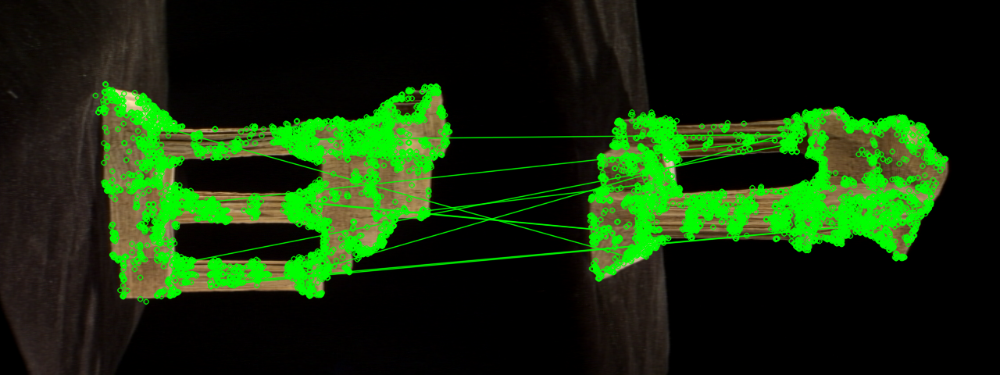

# Visualization User Guide (keypoints, matches, point clouds)

All 2D/3D inspection tools. None of these run the full SfM optimization —
they reuse the exact detection/matching/geometry code or just load saved
outputs.

## 1. Classical keypoints + matches (`viz_matches.py`)

Dumps PNGs without running reconstruction. Uses the same
`make_detector()` / `detect_features()` / `match_all()` /
`geometric_verify()` as `run.py`, with GT `K` when available
(`load_K()` mirrors `run.py`; else `estimate_intrinsics()`).

```bash
python viz_matches.py --feature_type sift
python viz_matches.py --feature_type orb --pairs "0,1 1,2 2,3"
python viz_matches.py --feature_type sift --interactive
```

| Flag | Default | Meaning |
|---|---|---|
| `--feature_type` (required) | — | `sift` or `orb` |
| `--images` | `config.IMAGES_DIR` | input folder |
| `--out` | `outputs/<feature_type>_viz/` | output root |
| `--gt_calibration` | `config.GT_CALIBRATION_PATH` | K source |
| `--matching_strategy` | `config.MATCHING_STRATEGY` (`sequential`) | `sequential` or `exhaustive` |
| `--match_window` | `config.MATCH_WINDOW` (`6`) | sequential neighbor radius |
| `--max_features` | `4000` | cap per image (both SIFT/ORB) |
| `--pairs` | all matched pairs | e.g. `"0,1 1,2"` (frame indices) |
| `--interactive` | off | also `cv2.imshow` each match image |

Outputs:

```
outputs/<feature_type>_viz/
  keypoints/keypoints_<i>.png   # red circles, fixed r=3 so big SIFT scales stay readable
  matches/<i>_<j>.png           # ALL raw matches red + RANSAC inliers overlaid green
  matches/inliers_<i>_<j>.png   # only RANSAC-verified inliers (green)
```

How to read them: green/red ratio ≈ inlier ratio; mostly-red pairs are weak
(overlap / texture / repetitive structure). Compare ORB vs SIFT on the same
pair — SIFT is usually denser and greener on TempleRing.




## 2. Classical 3D viewer (`view.py`)

Interactive Open3D viewer for a finished classical run. Loads
`points3D_open3d.ply` (falls back to `points3D.ply`) + `cameras.json`,
draws the cloud plus one orange wireframe frustum per camera
(`camera_frustum()`, scale = 3% of cloud bbox diagonal).

```bash
python view.py outputs/sift
python view.py outputs/orb --point_size 5.0
```

| Arg | Meaning |
|---|---|
| `results_dir` | e.g. `outputs/sift` |
| `--point_size` (default `3.0`) | accepted for API compatibility (interactive renderer setting) |

Close the window to exit. Empty cloud → `[view] ERROR: point cloud is empty.`
MeshLab alternative (sparse unmeshed cloud — use Point Splatting):

```bash
meshlab outputs/sift/points3D.ply
```

Note: the pipeline also writes a best-effort `points3D_open3d.png` snapshot via
a headless Open3D worker (`sfm/visualization.py`). On
GPU-less servers it prints `[open3d] snapshot render unavailable ...` — the
`.ply` is still fine; open it locally.


## 3. Deep-learning 3D viewer (`deep_learning_pipeline/visualize.py`)

```bash
python -m deep_learning_pipeline.visualize --sfm-dir outputs/lightglue/sparse
python -m deep_learning_pipeline.visualize --sfm-dir outputs/lightglue/sparse --frustum-scale 0.08
```

Loads the binary COLMAP model with `pycolmap.Reconstruction`, shows the
**colored** sparse cloud + small **red** frustums sized from the real
calibration (`calibration_matrix()`, `projection_center()`).


## 4. Which tool for what

| Want | Run |
|---|---|
| Are my features sane? | `viz_matches.py` keypoints |
| Why did pair (i,j) fail? | `viz_matches.py` matches/inliers for that pair |
| Inspect finished geometry | `view.py` (classical) / `visualize.py` (deep) |
| Publishable figure | screenshot of the above, saved under `docs/assets/` |
